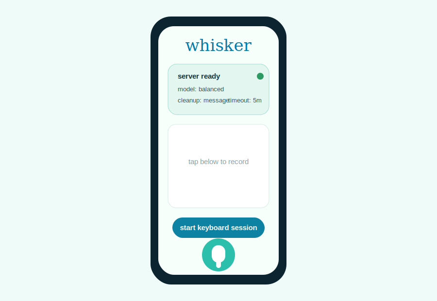
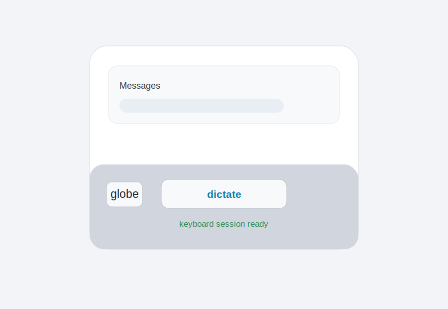
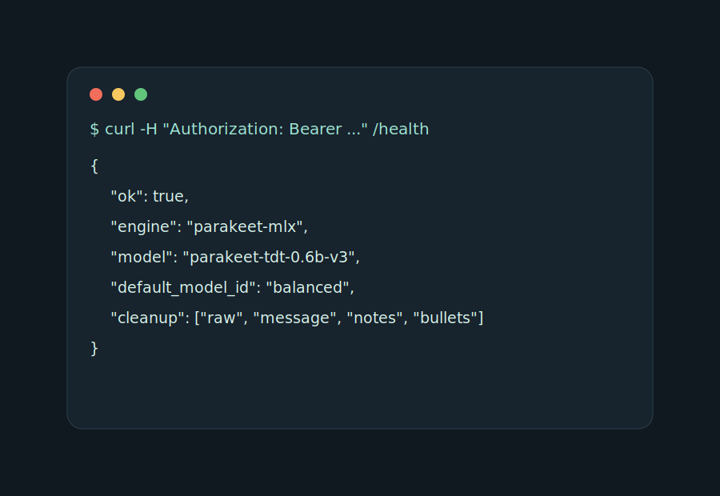

# Whisker

Whisker turns an iPhone keyboard into a remote Mac-powered dictation client. The iPhone records temporary audio, sends it to your private transcription server over LAN or Tailscale, and inserts the returned text back into the app or keyboard.

Whisker does not run speech recognition on the iPhone, does not download iPhone ASR models, and does not expose fake backend choices. The server owns transcription, model selection, cleanup, and inference speed.

## Screenshots

| iPhone app | Keyboard | Server |
| --- | --- | --- |
|  |  |  |

## Why This Exists

- Avoid slow or unavailable on-device transcription on iPhone.
- Use stronger Mac-hosted speech models while keeping the phone interface lightweight.
- Dictate from iPhone through a trusted LAN or Tailscale network without exposing a raw public service.

## Architecture

```text
iPhone app records temporary audio
-> keyboard extension requests dictation through the shared app container
-> Mac server performs transcription with the configured model
-> result returns to the app or keyboard for display, copy, history, or insertion
```

Technical highlights:

- SwiftUI iOS app.
- Custom native-looking keyboard extension.
- Authenticated remote ASR server.
- Configurable model profiles and cleanup modes.
- Tailscale-friendly private networking.

## Quick Start

1. Clone the repo on the Mac that will run transcription.
2. Configure and start the server:

   ```sh
   cd ~/src/whisker
   python3 -m venv server/.venv
   server/.venv/bin/python -m pip install -r server/requirements.txt
   cp server/.env.example server/.env
   # Edit server/.env and set WHISKER_AUTH_TOKEN to at least 32 random characters.
   WHISKER_REMOTE_ROOT="$PWD" server/run_server.sh
   ```

3. Verify the server from another device on the same trusted network:

   ```sh
   curl -sS -H "Authorization: Bearer $WHISKER_AUTH_TOKEN" http://<mac-ip>:8787/health
   ```

4. Build, sign, and install the iPhone app from Xcode.
5. In Whisker Settings, enter `http://<mac-ip>:8787` and the same bearer token.
6. Enable the Whisker keyboard in iOS Settings and turn on Allow Full Access.
7. From a text field, switch to the Whisker keyboard and tap Dictate. Whisker opens, starts a handoff session, then you can return to the text field and dictate.

## Platform Support

- iPhone app and keyboard: macOS with Xcode only. Linux cannot build, sign, or install the iOS app or keyboard extension.
- Server: Python/FastAPI code can be developed on macOS or Linux, but the default `parakeet_mlx` backend targets Apple Silicon/macOS. Linux server use requires a Linux-compatible ASR backend such as `whisper.cpp`.
- Intended full setup: iPhone plus a trusted Mac transcription server over LAN or Tailscale.
- The keyboard flow requires App Groups provisioning for both the app target and keyboard extension.

## iPhone Setup

- Install the Whisker app and keyboard extension.
- Grant microphone permission when prompted.
- Add the Whisker keyboard in iOS Settings.
- Enable Allow Full Access for the keyboard so it can use the shared app container.
- Configure the server URL, bearer token, timeout, model, and default cleanup mode inside Whisker Settings.

The keyboard does not record audio directly. iOS third-party keyboard constraints require the main app to own microphone capture, so opening Whisker from the keyboard starts a handoff session and results move back through the app group handoff file. Individual recordings are capped at five minutes.

## Xcode Signing

To install Whisker on your iPhone, you need Xcode on a Mac and an Apple ID.

1. Open `Whisker.xcodeproj` in Xcode.
2. Select the `Whisker` project, then the `Whisker` app target.
3. Open Signing & Capabilities.
4. Set Team to your Apple ID team.
5. Change Bundle Identifier from `app.whisker` to a unique value, for example `com.example.whisker`.
6. Select the `WhiskerKeyboard` target.
7. Set the same Team.
8. Change its Bundle Identifier to match your app prefix, for example `com.example.whisker.Keyboard`.
9. Keep the App Group value aligned between both targets. Xcode may require changing `group.app.whisker` to a unique group such as `group.com.example.whisker`.
10. Select your connected iPhone as the run destination and press Run.

Use a paid Apple Developer account for the most reliable path because Whisker needs the App Groups capability for app-to-keyboard handoff. A free Personal Team can sign some development builds, but it may fail when Xcode tries to provision App Groups or app-extension capabilities. If Xcode cannot create or assign the App Group, use a paid developer team.

## Mac Server Setup

Server setup is documented in [server/README.md](server/README.md). The short version:

```sh
cd ~/src/whisker
python3 -m venv server/.venv
server/.venv/bin/python -m pip install -r server/requirements.txt
cp server/.env.example server/.env
WHISKER_REMOTE_ROOT="$PWD" server/run_server.sh
```

Required configuration:

- `WHISKER_AUTH_TOKEN`: bearer token shared with the iPhone app; minimum 32 characters.
- `WHISKER_BIND_HOST`: `127.0.0.1` for local-only, `0.0.0.0` for LAN, or a Tailscale IP.
- `WHISKER_PORT`: default `8787`.
- `WHISKER_DEFAULT_MODEL_ID`: `fast` or `balanced`.

## Tailscale And LAN

Use Whisker only on networks you trust.

- LAN: bind to `0.0.0.0`, then use `http://<mac-lan-ip>:8787` in the app.
- Tailscale direct IP: bind to your Mac tailnet IP, then use `http://<tailscale-ip>:8787`.
- Tailscale Serve: keep the server on loopback and expose it with Tailscale Serve.

Do not put this raw FastAPI service on the public internet. If you need internet exposure, put it behind a real reverse proxy with TLS, authentication, rate limits, and logs you review.

## Models

The server exposes two model profiles to the app:

| Profile | Default model | Use |
| --- | --- | --- |
| `fast` | `mlx-community/parakeet-tdt_ctc-110m` | Lowest latency short dictation. |
| `balanced` | `mlx-community/parakeet-tdt-0.6b-v3` | Default quality/speed tradeoff. |

Override these with `WHISKER_FAST_MODEL` and `WHISKER_PARAKEET_MODEL`.

## Cleanup Modes

- `raw`: return the ASR transcript unchanged.
- `light`: trim and normalize whitespace.
- `message`: light cleanup plus first-letter capitalization.
- `email`: currently the same style as message.
- `notes`: split sentence-like text onto separate lines.
- `bullets`: split sentence-like text into a bullet list.

Cleanup runs on the server when the app requests cleaned text.

## Security Notes

- There is no default bearer token in source.
- All transcription and health API calls require `Authorization: Bearer <token>`.
- Uploaded audio is stored only in a temporary request directory and deleted after processing.
- Client filenames are not trusted for server paths.
- The default bind host is loopback.
- Expose only over trusted LAN/Tailscale; do not put this raw on the public internet.

See [SECURITY.md](SECURITY.md) for reporting and hardening notes.

## Verification

Run before pushing a public branch:

```sh
swift test
python3 -m unittest discover server/tests
plutil -lint Whisker/Info.plist WhiskerKeyboard/Info.plist Whisker/Whisker.entitlements WhiskerKeyboard/WhiskerKeyboard.entitlements server/launchd/app.whisker.remote.plist
xcodebuild -project Whisker.xcodeproj -scheme Whisker -destination 'generic/platform=iOS' CODE_SIGNING_ALLOWED=NO build
rg -n -S '<private names, private IPs, local absolute paths, signing IDs>'
git status --short
```
